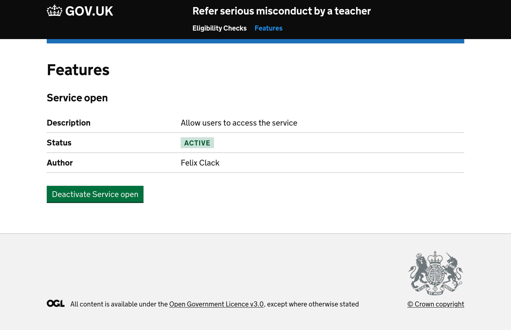

# FeatureFlags

A simple implementation of feature flags that are persisted in the database and controlled via
a basic admin UI.



## Installation

1. Add `govuk_feature_flags` gem to your `Gemfile`
1. Run `rails railties:install:migrations`
1. Run `rails db:migrate`
1. Mount the engine in the appropriate place in your routes file: eg. `mount FeatureFlags::Engine => "/features"`

## Usage

Define your feature flags in `config/feature_flags.yml`

```yaml
feature_flags:
  service_open:
    author: Your name
    description: Allow users to access the service
```

## Configuration

The engine assumes the parent app uses a layout with the name `application.html.erb`.

To use a different layout template set the `layout` option in the config file.

```yaml
layout: admin
feature_flags:
  service_open:
    author: Your name
    description: Allow users to access the service
```

`FeatureFlagsController` can be configured to inherit from a controller in the parent application, useful if you want to mount behind authentication or to inherit other behaviours.

```yaml
parent_controller: "SupportInterface::SupportInterfaceController"
feature_flags:
```

## License

[MIT](LICENCE).
